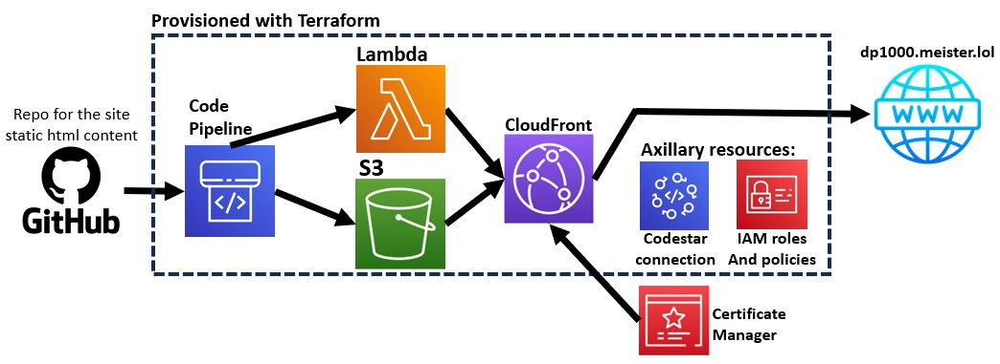

# Static site Deployment using terraform. project dp1000

This project demonstrates provisioning of a aws static site using terraform.
This site is simple, but yet, more complicated than the usual S3 bucket static site.
The site extra features are: better access latency worldwide due to using CloudFront CDN,
use a ssl certificate to encrypt the connection to the site, and custom error pages
The static files for the website can be found [On this repo](https://github.com/OmerMeister/dp1000-webcontent).

## Diagram

## Resources composition

S3 Buckets: 
**dp1000_webcontent** - site static content is copied to here from GitHub. 
**dp1000_codepipelineartifact** - stores the codepipeline resource artifacts'. 

S3 bucket policy: 
**dp1000_allow_readget_access_cloudfront_to_s3** - attaches the policy with the same name to the "dp1000_webcontent" bucket. 

S3 bucket website configuration: 
**dp1000_webcontent** - enables default static website configurations for the bucket with the same name. 

Policies: 
**dp1000_allow_readget_access_cloudfront_to_s3** - uses "aws_iam_policy_document" which is optional resource type for not using json for aws policies in terraform - allows access from cloudfront to the s3 for invalidations, and files check for 404 errors. 
**dp1000_lambda1_policy** - uses jsonencode - allows the lambda to access codepipeline to report success/failure. allows access to cloudfront to create invalidations 
**dp1000_pipeline_policy** - uses jsonencode - allows access to many aws resources for the pipeline to use. I got the policy as is from aws. 

Roles: 
**dp1000_lambda1_role** - uses jsonencode - doesn't any special settings. 
**dp1000_pipeline_role** - uses jsonencode - doesn't any special settings.

Policy attachments: 
**dp1000_lambda1_attachment** - attaches dp1000_lambda1_policy to its corresponding role 
**f1000_pipeline_attachment** - attaches dp1000_pipeline_policy to its corresponding role

CloudFront distribution: 
**dp1000_cf_distribution** - CDN to serve the webpages, gets a certificate installed for the relevant domain name

Cloudfront origin access control: 
**dp1000_oac** - required by the cloudfrotn distribution to securely fetch files from the S3

Data archive file: 
**dp1000_python_code** - terraform resource to point on the python code file for the lambda function.

Lambdas: 
**dp1000_lambda1** - function creates invalidation of all files within a cloudfront distribution. Gets the ID of the cf-dist as an environment variable, which gets its value from the cf-dist resource of "dp1000_cf_distribution"

CodeStar Connections: 
**OmerMeister_GitHub** - made with "GitHub v2" api for accessing resources from GitHub, based on one time authorization made by the GitHub account owner to aws GitHub app. the codestar connection itself also has to be manually approved once. I could really on already existed one but created it with Terraform just to show its possible.

CodePiplines: 
**dp1000_codepipeline** - The pipeline has three steps: 1 - gets triggered by a commit on a specific GitHub repository, then download the commit content to a temporary zip. 2 - extracts the zip contents to the S3 bucket. 3 - calls the lambda function to create a distribution invalidation. the invalidation makes cloudfront update its site content.

## Variables and Tages
On the variables file there are: 
**meister_lol_certificate_us_east_1** - my global certificate for various projects. cloudfront demands a certificate from 'us-east-1' region. 
**project_domain_name** - unifies 10 appearances of the project domain in the main.tf file 
 On the Terraform cloud there are: 
**AWS_ACCESS_KEY_ID** and **AWS_SECRET_ACCESS_KEY** - to access the aws account. 
**AWS_DEFAULT_REGION** - to set region, i worked on 'us-east-1' when possible. 
 Tags: 
**Project = dp1000** - 'dp' for 'DevOps Project' and '1000' for the first project in a four digit convention. This tag is attached whenever is possible. It groups all resources which are belong solely to this project

## Disadvantages and outside resources

- Files which get delete from the GitHub repository doesn't get deleted on the S3 bucket and therefore also not from the cloudfront distribution, possible fix could be achieved using aws' vcs "CodeCommit" instead of GitHub.
- The AWS Certificate Manager for the certificate of the domain "*.meister.lol" was created outside of this script because it uses for other purposes than this project itself.

